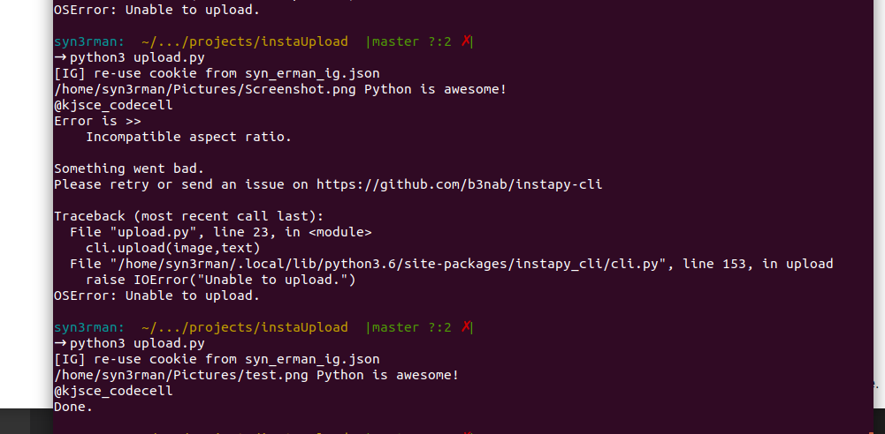

# instaUpload
Cron-ish script to upload most recently modified image in a directory to instagram


## Description 

Uploads the most recently added file in the specified directory to instagram with a caption. 

Run with the command:
```
nohup python3 upload.py &
```

Example output: 

<div align = "center">


<br> <br>


 </div>


</div>